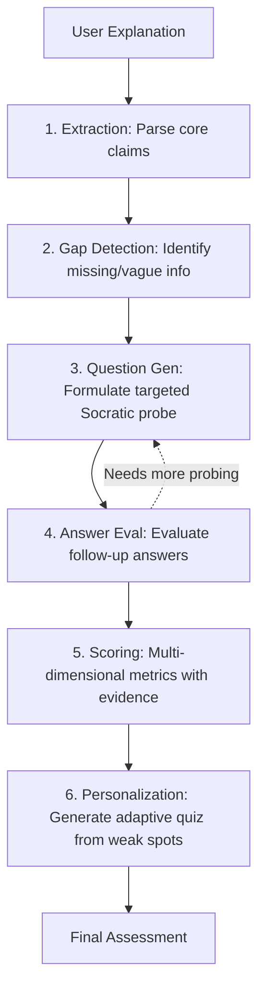

<div align="center">
  <div style="background-color: #111111; color: white; width: 80px; height: 80px; display: flex; align-items: center; justify-content: center; font-size: 40px; font-weight: 900; border-radius: 20px; margin: 0 auto 24px;">F</div>
  <h1>Feynr — Learn by Explaining</h1>
  <p><em>"The best way to learn is to teach."</em></p>
  <p>
    <a href="(https://youtu.be/WPgsAt4Orqk)"><strong>Watch Video</strong></a>
  </p>
</div>

<br />

**Feynr** is an AI-powered Socratic learning platform built on the Feynman Technique. Instead of passively reading or watching lectures, you explain a concept to an AI agent — which then probes your understanding with targeted follow-up questions and gives you a detailed clarity report showing exactly what you know and what you don't.

Built for the **Microsoft Agents League @ AI Skills Fest 2026** — **Track 1: Creative Apps (GitHub Copilot)**.

---

## 🛑 The Problem

Most students suffer from the **"illusion of knowing"** — they recognize a concept when they see it but can't reconstruct it from scratch. Existing tools like flashcards and quizzes test mere recall, not deep understanding. There's currently no accessible tool that forces you to externalize and stress-test what's actually in your head.

## 💡 The Solution

Feynr acts as your personal Socratic learning partner:
1. **Explain:** You pick a topic and explain it in your own words.
2. **Discuss:** An AI agent actively listens and asks 3-5 targeted follow-up questions to probe your gaps.
3. **Analyze:** You receive a clarity report with dimensional scores and a personalized quiz.

---

## ✨ Features

- **Explanation Canvas** — Free-form distraction-free writing environment with word count thresholds and real-time guidance.
- **Socratic Q&A Session** — An adaptive conversational UI where the AI asks one focused question at a time targeting your specific logical gaps.
- **Clarity Report** — Comprehensive dimensional scoring across Accuracy, Depth, Clarity, and Completeness, highlighting exact misconceptions and next steps.
- **Adaptive Quiz** — A dynamically generated 4-question quiz built exclusively from YOUR weak spots, not just generic topic trivia.

---

## 🧠 AI Pipeline (6 Stages)

Feynr operates on a multi-step reasoning pipeline rather than simple zero-shot generation:



---

## 🛠️ Tech Stack

Feynr is built with a modern, high-performance web stack:

- **Framework:** Next.js 16 (App Router, Turbopack)
- **Language:** TypeScript
- **Styling:** Tailwind CSS v4 & custom CSS tokens
- **Animations:** Framer Motion
- **Icons:** Lucide React
- **AI/LLM Engine:** Groq API (Llama 3 / Mixtral for ultra-low latency Socratic reasoning)

---

## 📁 Project Structure

```text
feynr/
├── app/
│   ├── explain/       # Step 1: Topic selection & explanation canvas
│   ├── session/       # Step 2: Live Socratic Q&A interface
│   ├── report/        # Step 3: Dimensional scoring & analysis report
│   └── quiz/          # Step 4: Adaptive personalized assessment
├── api/
│   ├── analyze/       # Initial gap detection pipeline
│   ├── followup/      # State-aware Socratic question generator
│   └── report/        # Final comprehensive evaluation metric generation
├── components/        # Reusable UI (Navbar, HeroSection, Loading states)
└── lib/               # Shared logic, prompts, and local storage state
```

---

## 🚀 Getting Started

### Prerequisites
- Node.js 20+
- Groq API key (Get one free at [console.groq.com](https://console.groq.com))

### Installation

```bash
# Clone the repo
git clone https://github.com/a-yush101/feynr.git
cd feynr

# Install dependencies
npm install

# Set up environment variables
cp .env.example .env.local
```

Open `.env.local` and add your API key:
```env
GROQ_API_KEY=your_groq_api_key_here
```

### Run the Development Server
```bash
npm run dev
```

Open [http://localhost:3000](http://localhost:3000) to see the app.

---

## 🤖 How GitHub Copilot Was Used

GitHub Copilot was an essential pair-programmer throughout the development of Feynr:

- **System Prompt Engineering** — Copilot helped design, refine, and structure the 4 distinct AI system prompts for the analyzer, Socratic agent, report generator, and quiz generator.
- **API Route Generation** — The Next.js API routes were rapidly prototyped and built using Copilot Chat with detailed multi-shot prompts.
- **Type Safety** — Complex TypeScript interfaces in `lib/types.ts` (representing the rigid JSON schema for the LLM output) were generated and validated with Copilot.
- **Component Architecture** — Layouts, state management, and Framer Motion orchestrations were built with Copilot's inline autocomplete assistance.
- **Error Handling** — Robust JSON parsing logic and API fallback handling patterns were implemented directly from Copilot suggestions.

---

## 🏆 Judging Criteria Alignment

| Criterion | How Feynr Addresses It |
|-----------|------------------------|
| **Accuracy & Relevance** | Targets a very real, universal student pain point: the illusion of knowing. |
| **Reasoning & Multi-step** | Features a 6-stage AI reasoning pipeline, constantly evaluating state. |
| **Creativity & Originality** | Flips the script: instead of the AI lecturing you, the AI forces *you* to lecture *it*. |
| **UX & Presentation** | Delivers a clean, cohesive 5-page flow with smooth Framer Motion transitions. |
| **Reliability & Safety** | Uses stateless API routes, no database dependencies, and graceful JSON validation/error handling. |
| **Community Vote** | The Feynman Technique is universally known and highly respected in academic circles. |

---

## 🌐 Live Demo & Video

- **Live URL:** [feynr.vercel.app](https://feynr.vercel.app)
- **Demo Video:** [Watch on YouTube](#) *(Add link here)*

---

<div align="center">
  <p>Built with ❤️ and GitHub Copilot for <strong>Microsoft Agents League @ AI Skills Fest 2026</strong>.</p>
</div>
